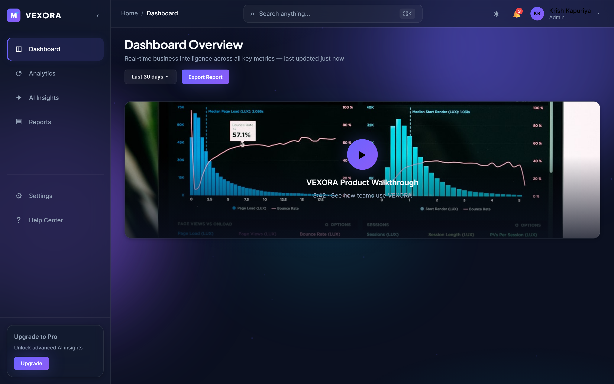
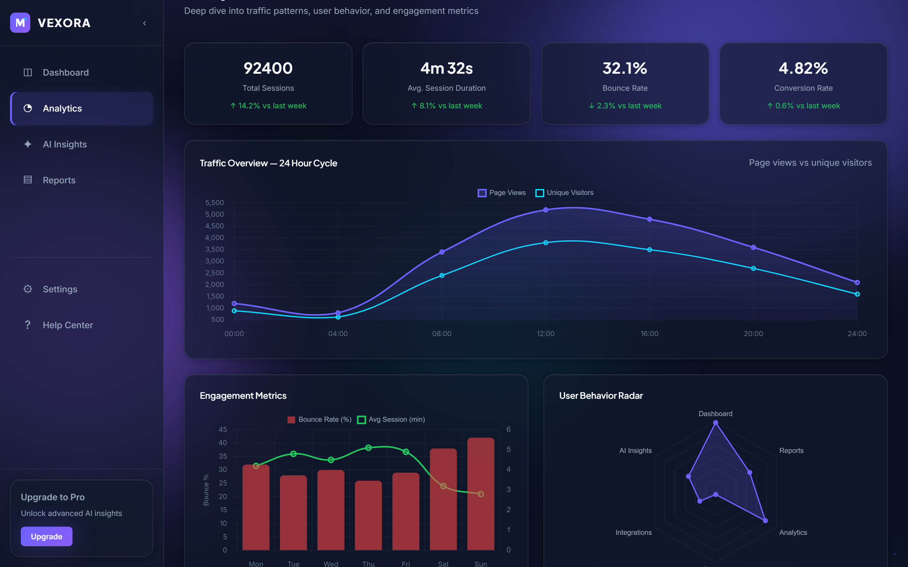
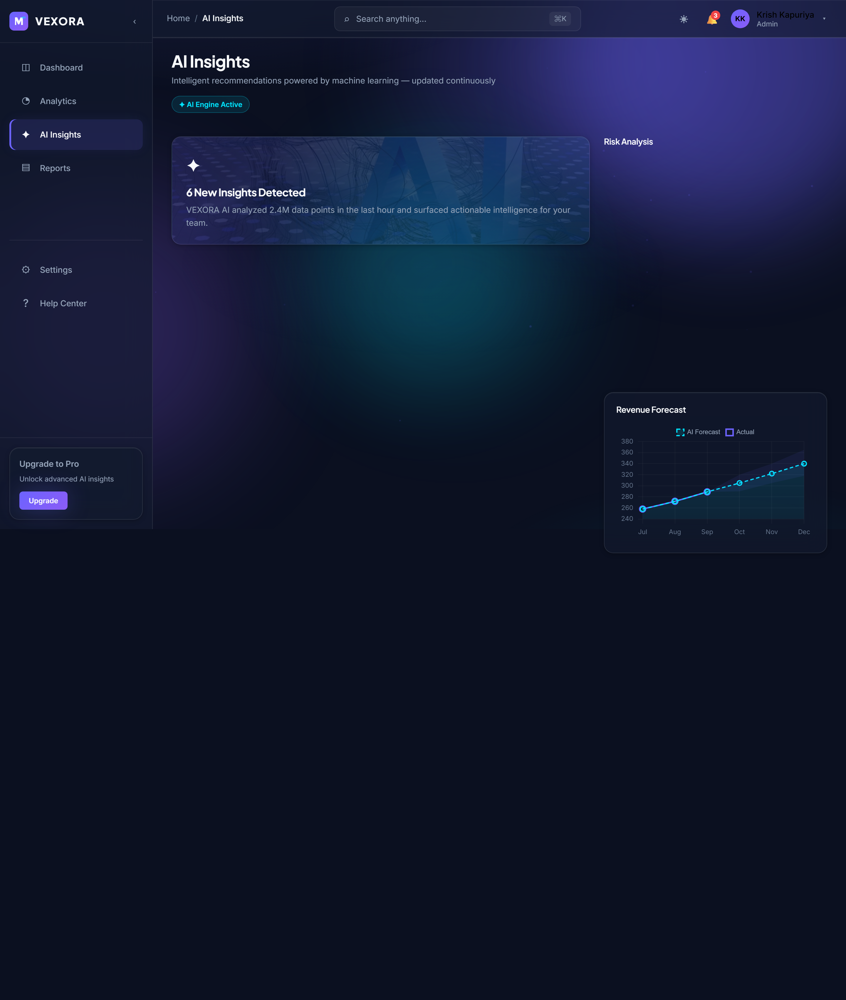
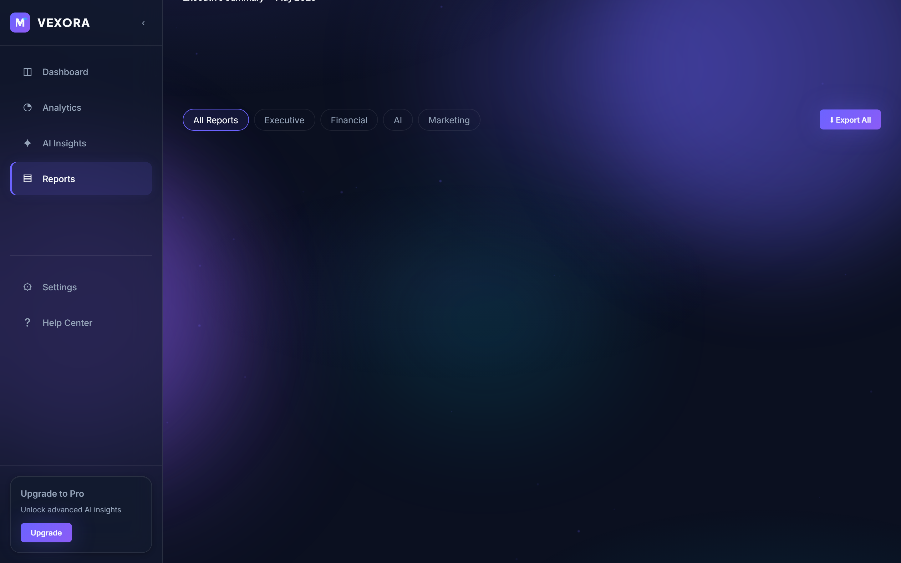
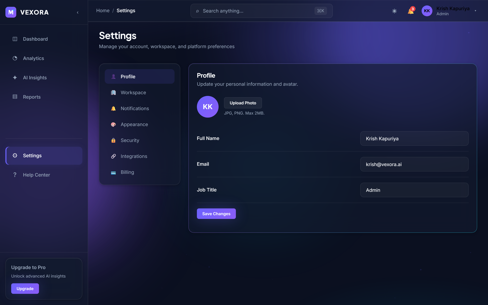

<div align="center">


# VEXORA

### AI-Powered Business Intelligence & Analytics Platform

Monitor KPIs, visualize analytics, explore AI-generated insights, and make data-driven decisions — from a premium, enterprise-grade dashboard.

<br />

[](https://developer.mozilla.org/en-US/docs/Web/HTML)
[](https://developer.mozilla.org/en-US/docs/Web/CSS)
[](https://developer.mozilla.org/en-US/docs/Web/JavaScript)
[](https://www.chartjs.org/)
[](LICENSE)

<br />

[](https://krishkapuriya04.github.io/vexora-ai-dashboard/)

<br />

[Features](#-features) · [Screenshots](#-screenshots) · [Installation](#-installation) · [Deployment](#-deployment) · [Roadmap](#-roadmap)

<br />



*Dashboard overview with real-time KPIs, revenue charts, activity timeline, and AI recommendations.*

</div>

---

## Overview

**VEXORA** is a production-quality SaaS dashboard built entirely with vanilla web technologies — no frameworks, no backend, no build step. It demonstrates how far you can push modern HTML, CSS, and JavaScript to deliver an experience that rivals funded startups like Linear, Stripe, and Vercel.

The platform includes a full marketing landing page and a multi-page analytics application with realistic mock business data, interactive Chart.js visualizations, command search, notifications, theme switching, and a complete design system.

> Built as a portfolio-grade project showcasing frontend architecture, UI/UX craft, and enterprise coding standards.

---

## Features

### Landing Page
- Premium hero with animated statistics and dashboard preview
- Product showcase with live Chart.js revenue chart
- AI insights, analytics, and dashboard previews
- Testimonials, pricing tiers, and call-to-action sections
- SEO-friendly semantic HTML with Open Graph meta tags

### Application Dashboard
- **6 KPI cards** — Revenue, Active Users, Growth, Conversion, AI Score, CSAT
- **Interactive charts** — Revenue trend, user growth, devices, traffic, funnel, geography
- **Activity timeline** — Live business event feed
- **AI recommendation feed** — Compact insight cards with deep-link to AI Insights
- **Product demo video** — Modal player with replaceable embed URL

### Analytics
- 24-hour traffic overview with dual-axis charts
- Engagement metrics and user behavior radar
- Geography breakdown and activity heatmap
- Quick stat cards with animated counters

### AI Insights
- AI recommendation feed with confidence scores
- Risk analysis rings (churn, revenue, compliance, volatility)
- Revenue forecast chart with prediction bands
- Opportunity matrix bubble chart

### Reports & Settings
- Reports library with executive summary cards and export UI
- Filterable report categories with professional empty states
- Settings panel — Profile, Workspace, Notifications, Appearance, Security, Integrations, Billing

### Platform UX
- Collapsible sidebar with mobile navigation
- Command palette search (`⌘K` / `Ctrl+K`)
- Notification center with read/unread states
- Profile dropdown menu
- Dark / light theme switcher
- Skeleton loaders, scroll reveals, and page transitions
- Aurora backgrounds, glassmorphism, and micro-interactions

---

## Tech Stack

| Layer | Technology |
|-------|------------|
| **Markup** | HTML5 — semantic, accessible, SEO-friendly |
| **Styling** | CSS3 — custom properties, glassmorphism, mobile-first responsive |
| **Logic** | Vanilla JavaScript — ES modules, zero dependencies in runtime |
| **Charts** | [Chart.js](https://www.chartjs.org/) v4.4 — line, bar, doughnut, radar, bubble, polar |
| **Fonts** | [Inter](https://fonts.google.com/specimen/Inter) + [Plus Jakarta Sans](https://fonts.google.com/specimen/Plus+Jakarta+Sans) |
| **Data** | Centralized mock datasets — no backend or database |
| **Tooling** | Playwright (screenshot capture), automated QA script |

**Design inspiration:** Stripe · Linear · Framer · Vercel · Arc Browser · Raycast

---

## Screenshots

<table>
  <tr>
    <td align="center" width="50%">
      <br />
      <strong>Landing Page</strong><br />
      <sub>Marketing site with hero, features, and live demo CTA</sub>
    </td>
    <td align="center" width="50%">
      <br />
      <strong>Dashboard</strong><br />
      <sub>KPI metrics, charts, timeline, and AI feed</sub>
    </td>
  </tr>
  <tr>
    <td align="center" width="50%">
      <br />
      <strong>Analytics</strong><br />
      <sub>Traffic overview, heatmap, and engagement metrics</sub>
    </td>
    <td align="center" width="50%">
      <br />
      <strong>AI Insights</strong><br />
      <sub>Recommendations, risk analysis, and forecasting</sub>
    </td>
  </tr>
  <tr>
    <td align="center" width="50%">
      <br />
      <strong>Reports</strong><br />
      <sub>Executive summaries and report library</sub>
    </td>
    <td align="center" width="50%">
      <br />
      <strong>Settings</strong><br />
      <sub>Profile, integrations, security, and billing</sub>
    </td>
  </tr>
</table>

> High-resolution @2x captures available in [`portfolio-assets/screenshots/full/`](portfolio-assets/screenshots/full/)

---

## Folder Structure

```
vexora/
├── index.html                      # Marketing landing page
│
├── pages/                          # Application pages
│   ├── dashboard.html              # KPI dashboard
│   ├── analytics.html              # Advanced analytics
│   ├── insights.html               # AI insights explorer
│   ├── reports.html                # Reports library
│   └── settings.html               # Account & workspace settings
│
├── css/
│   ├── variables.css               # Design tokens
│   ├── global.css                  # Reset, typography, components
│   ├── animations.css              # Keyframes & motion utilities
│   ├── landing.css                 # Landing page sections
│   ├── app.css                     # Dashboard shell & layout
│   ├── pages.css                   # Page-specific components
│   ├── upgrade.css                 # Premium UI enhancements
│   └── polish.css                  # Elite polish & empty states
│
├── js/
│   ├── app.js                      # Landing page bootstrap
│   ├── dashboard-app.js            # App pages bootstrap
│   ├── shell.js                    # Sidebar, topbar, modals
│   ├── mock-data.js                # Centralized business data
│   ├── chart-utils.js              # Shared Chart.js config
│   ├── micro-interactions.js       # Particles, magnetic hover, counters
│   ├── theme.js                    # Dark / light theme
│   ├── animations.js               # Scroll reveals & loaders
│   └── pages/                      # Page-specific chart init
│       ├── dashboard.js
│       ├── analytics.js
│       ├── insights.js
│       ├── reports.js
│       └── settings.js
│
├── components/
│   └── ui-components.js            # Reusable DOM factories
│
├── assets/
│   ├── icons/                      # Logo, favicon (SVG)
│   └── images/                     # OG preview, imagery
│
├── portfolio-assets/               # Showcase screenshots & capture tooling
│   ├── capture-screenshots.mjs
│   └── screenshots/
│
└── scripts/
    └── verify.mjs                  # Automated QA verification
```

---

## Installation

### Prerequisites

- A modern browser (Chrome, Edge, Firefox, Safari)
- [Node.js](https://nodejs.org/) 18+ (optional — for local server & tooling)

### Quick Start

```bash
# Clone the repository
git clone https://github.com/krishkapuriya04/vexora-ai-dashboard.git
cd vexora-ai-dashboard

# Serve locally
npx serve .
```

Open **http://localhost:3000** in your browser.

### Application Pages

| Page | URL |
|------|-----|
| Landing | `/index.html` |
| Dashboard | `/pages/dashboard.html` |
| Analytics | `/pages/analytics.html` |
| AI Insights | `/pages/insights.html` |
| Reports | `/pages/reports.html` |
| Settings | `/pages/settings.html` |

### NPM Scripts

```bash
npm run serve         # Start local server on port 3456
npm run screenshots   # Capture portfolio screenshots (requires serve running)
```

### Quality Assurance

```bash
npx serve . -p 3456
node scripts/verify.mjs
node scripts/verify-paths.mjs   # GitHub Pages path audit
npm run test:auth
npm run test:data
npm run test:export
npm run test:admin
npm run test:billing            # Requires Razorpay test keys in .env
npm run test:ai                 # Requires GEMINI_API_KEY or GEMINI_MOCK=true
```

---

## Google Gemini AI Setup

VEXORA uses **Google Gemini** to power the AI Business Intelligence Engine. The API key is loaded from environment variables — never hardcoded.

### 1. Get API Key

1. Visit [Google AI Studio](https://aistudio.google.com/apikey)
2. Create a free API key
3. Copy the key

### 2. Configure Environment

Add to your `.env` file:

```env
GEMINI_API_KEY=your_gemini_api_key
GEMINI_MODEL=gemini-2.0-flash
```

### 3. AI Features

| Feature | Endpoint | Category |
|---------|----------|----------|
| Executive Summary | `POST /api/ai/generate-summary` | KPI interpretation, performance overview |
| Recommendations | `POST /api/ai/generate-recommendations` | Growth, revenue, retention advice |
| Risk Analysis | `POST /api/ai/generate-risk-analysis` | Risks, weak metrics, concerns |
| Forecast | `POST /api/ai/generate-forecast` | Revenue, growth, user projections |
| History | `GET /api/ai/history` | Organization-scoped AI generation log |

AI prompts are built from real VEXORA data: dashboard metrics, reports, activities, and subscription status.

### 4. Run AI QA

```bash
# Mock mode (no live Gemini API needed)
GEMINI_MOCK=true npm start
npm run test:ai
```

---

## Razorpay Billing Setup

VEXORA uses **Razorpay Test Mode** for subscription billing. API keys are loaded from environment variables — never hardcoded.

### 1. Get Test API Keys

1. Create a free account at [Razorpay Dashboard](https://dashboard.razorpay.com/)
2. Go to **Settings → API Keys**
3. Generate **Test Mode** keys (`rzp_test_...`)

### 2. Configure Environment

Copy `.env.example` to `.env` and add your keys:

```env
RAZORPAY_KEY_ID=rzp_test_your_key_id
RAZORPAY_KEY_SECRET=your_razorpay_test_secret
```

### 3. Start the Server

```bash
npm install
npm run seed    # optional demo data
npm start       # http://localhost:5000
```

### 4. Subscription Plans

| Plan | Price | ID |
|------|-------|-----|
| Starter | ₹499/month | `starter` |
| Growth | ₹1,499/month | `growth` |
| Enterprise | ₹4,999/month | `enterprise` |

### 5. Payment Flow

1. User selects a plan on the landing page or **Billing** page
2. Backend creates a Razorpay order (`POST /api/billing/create-order`)
3. Razorpay Checkout modal opens in the browser
4. On success, payment is verified server-side with HMAC signature check
5. Subscription activates for 30 days

### 6. Test Payments

Use Razorpay test card details in checkout:

- **Card:** `4111 1111 1111 1111`
- **Expiry:** any future date
- **CVV:** any 3 digits

Run automated billing QA:

```bash
# With mock mode (no live Razorpay API needed)
RAZORPAY_MOCK=true RAZORPAY_KEY_SECRET=test_qa_billing_secret npm start
npm run test:billing
```

### Billing API Endpoints

| Method | Endpoint | Description |
|--------|----------|-------------|
| GET | `/api/billing/plans` | List subscription plans |
| POST | `/api/billing/create-order` | Create Razorpay order (Admin/Manager) |
| POST | `/api/billing/verify-payment` | Verify payment & activate subscription |
| GET | `/api/billing/subscription` | Current organization subscription |
| GET | `/api/billing/history` | Payment history |

---

---

## Deployment

VEXORA is ready for **GitHub Pages** with no build step. All paths are relative, so the same files work locally and when hosted at a project URL.

**Live site:** https://krishkapuriya04.github.io/vexora-ai-dashboard/

### Enable GitHub Pages

1. Open **Settings → Pages** in the repository
2. Set **Source** to **Deploy from a branch**
3. Choose branch **`main`** and folder **`/ (root)`**
4. Save — the site publishes in 1–3 minutes

Full instructions, CLI commands, troubleshooting, and custom domain setup are in **[DEPLOYMENT.md](DEPLOYMENT.md)**.

### What makes it work

| File | Purpose |
|------|---------|
| `.nojekyll` | Disables Jekyll so all static assets are served |
| `404.html` | Branded not-found page with smart home link |
| `index.html` | Landing page at site root |
| Relative paths | No `/absolute` URLs — compatible with `/repo-name/` subpaths |

### Replace Demo Video

Edit `js/mock-data.js`:

```javascript
export const VIDEO_CONFIG = {
  videoUrl: 'https://www.youtube.com/embed/YOUR_VIDEO_ID?autoplay=1',
  // ...
};
```

---

## Design System

| Token | Value | Usage |
|-------|-------|-------|
| Primary | `#6C63FF` | Buttons, active states, charts |
| Secondary | `#8B5CF6` | Gradients, accents |
| Accent | `#00E5FF` | Highlights, badges, AI elements |
| Background | `#0B1020` | Page background |
| Card | `#131A2E` | Glass cards, panels |
| Text | `#F8FAFC` | Primary text |

**Typography:** Inter (body) · Plus Jakarta Sans (headings)

---

## Roadmap

### Completed

- [x] **Phase 1** — Landing page, design system, Chart.js previews
- [x] **Phase 2** — Full dashboard app (5 pages), shell navigation, modals
- [x] **Phase 3** — Premium polish, branding, micro-interactions, empty states
- [x] **Phase 4** — Portfolio screenshots, automated QA, capture tooling
- [x] **Phase 5** — GitHub Pages deployment, path verification, CI workflow

### Upcoming

- [ ] Client-side SPA routing (History API)
- [ ] PWA support with offline caching
- [ ] Backend integration layer (API-ready architecture)
- [ ] Real-time data streaming simulation
- [ ] Custom report builder with drag-and-drop

---

## License

This project is licensed under the **MIT License** — see [LICENSE](LICENSE) for details.

---

<div align="center">

**VEXORA** — Built with precision. Designed for impact.

<br />

If this project helped you, consider giving it a ⭐ on GitHub.

</div>
